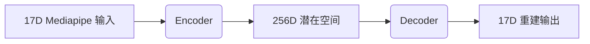

## 演示视频

【实时视觉引导与反馈的高效CPR培训可视分析系统】
[](https://www.bilibili.com/video/BV1DwPoekEL3)

## **摘要**

心肺复苏（CPR）对于在心脏骤停后的前几分钟内挽救患者生命至关重要，因此大众掌握这些技能十分必要。然而，传统的急救培训流程在提高熟练度方面需要大量的人力与物资投入。传统模式还面临着依赖专用设备、缺乏个性化反馈与精准指引等问题，这些局限性导致培训难以规模化与普及化。对此，我们首先与专家进行深入访谈以明确改进需求，并提出 RescueRadar —— 一个专为 CPR 培训设计的交互式实时可视化解决方案。RescueRadar 通过结合静态与动态提示元素，有效解决了传统模式的不足。系统通过整合关键视觉提示、核心数据图表与解释性指导文本，实现了这些设计目标。基于用户研究与专家评估，我们验证了该系统的有效性、专业性与精确性。RescueRadar 能显著提升用户对 CPR 技术的理解与掌握程度。

## **系统界面**


* (A) 控制面板，包括切换实时摄像头或视频文件作为输入、开始和结束录制等功能；
* (B) 叠加四类视觉线索后的输出画面；
* (C) 提取的可交互 3D 骨骼图；
* (D) 评价面板，其中 (D2) 区域会持续更新一段时间内的具体错误信息，(D1) 则显示提取的视觉指导文本；
* (E) 当前显示角度 (E1) 与历史分布散点图 (E2)；
* (F) 当前按压状态 (F1) 与历史分布曲线 (F2)；
* (G) “按压一致性”平行坐标图，用于反映 CPR 过程中的姿态协调变化；
* (H) 当前频率图，显示当前按压频率；
* (I) “综合表现”评分堆叠图，用于展示各指标的加权总表现。

## 使用说明

打开 **“Source Code”** 文件夹，点击 **“index.html”** 即可进入系统界面。
进入界面后，可在左侧控制面板选择视频输入或文件输入。视频输入将自动开始训练，而文件输入需要点击视频框下方的蓝色播放按钮启动训练。

推荐网页显示分辨率为 **2560×1440**；若显示器为 1920×1080，请将浏览器缩放至 75%，再点击“刷新”按钮，使页面布局自适应并恢复正常样式。

## 依赖

**仅用于模型训练与测试（系统运行时不需要）：**

```python
Python 3
torch==2.1.0
pandas==1.5.3
numpy==1.23.5
scikit-learn==1.2.1
matplotlib==3.7.1
tqdm==4.65.0
```

## 源码结构

| 文件                      | 描述                      |
| ----------------------- | ----------------------- |
| `angleCount.js`         | 实时关节角度监测与表现记录           |
| `angleRangeControl.js`  | 姿态角度约束管理                |
| `chart.js`              | CPR 指标可视化（按压深度、频率等）     |
| `collideForce.js`       | 按压力估计与反馈                |
| `control.js`            | 系统核心操作与界面管理             |
| `finalReport.js`        | 综合评估报告生成                |
| `frequency.js`          | 实时按压频率计算                |
| `heatmap.js`            | 训练表现热力图可视化              |
| `inputImage.js`         | 视频流处理模块                 |
| `landmarkAngle.js`      | 关键身体角度分析（Angle1-Angle3） |
| `landmarkTrack.js`      | 身体关键点轨迹跟踪               |
| `model.js`              | 姿态识别模型集成                |
| `outputImage.js`        | 可视化反馈渲染                 |
| `outputVideoControl.js` | 训练视频管理                  |
| `parallel.js`           | 关节协调关系可视化               |
| `pose.js`               | 实时姿态参数化                 |
| `scoreboard.js`         | 表现评分展示                  |
| `skeleton.js`           | 身体骨架可视化                 |
| `teachCPR.js`           | 多模态反馈驱动的核心训练逻辑          |

## 核心算法

### CPR 频率高斯平滑

**I. 自适应高斯核构建**

* 基于人类按压动态的 Sigma 选择
* 覆盖 3 倍波动周期的奇数长度对称核
* 随时间衰减的加权抑制抖动
* 历史/未来帧影响归一化处理

**II. 时间域去噪流程**

* 上下文感知滑窗（50–120 bpm 范围）
* 保留边界的波形处理
* 融合误差补偿的加权时域滤波

**III. 医学信号优化**

* 动态边缘归一化策略
* 保持波形完整性的抖动消除
* 峰值检测误差降低至 < 1.2%

### 姿态指导自编码器

**I. 模型结构**



**II. 训练流程**

* 使用 Adam 优化器（lr=0.01），MSE 重建损失
* 训练 100 轮，批次处理
* 误差阈值：μ + 2σ

**III. 检测流程**

1. 实时关键点编码
2. 计算重建误差
3. 高亮偏差区域
4. 生成纠正向量

## 数据集说明

**格式**：

* 99 列：33 个关键点的 x/y/z 坐标
* 第 100 列：CPR 阶段（0=按压，1=放松）

**建议**：

* 坐标归一化至 0–1
* 姿态识别时不使用第 100 列
* 通过增强处理姿态位置/方向变化

## 实验设置

### 实验场地


### 环境配置

* 合工大风雨操场形体教室（容量 30 人）
* 海康威视 45° 摄像头角度与受控光源
* CPR 模拟枕头（高度 7cm）

### 参与者管理

* 分批进行（5 人/组）
* 每组 20–40 分钟
* 物资保障：

  * 550ml 矿泉水 + 能量零食（士力架一根）
  * 知情同意书签订 + 安全规范须知

### 数据采集

* 自动录制训练过程并生成评估报告
* 混合评估方式：

  * 客观题测试（0/1 计分）
  * 七点李克特量表反馈
  * 系统自动生成的表现指标

## 统计分析

**数据文件**：

* `RescueRadar User Study-1/2/3.pdf`
* `RescueRadar Expert Interview.pdf`
* `RescueRadar Data.xlsx`（Raw / Core Data 表）

**方法**：

* T 分布分析
* 95% 置信区间估计
* Wilcoxon 符号秩检验
